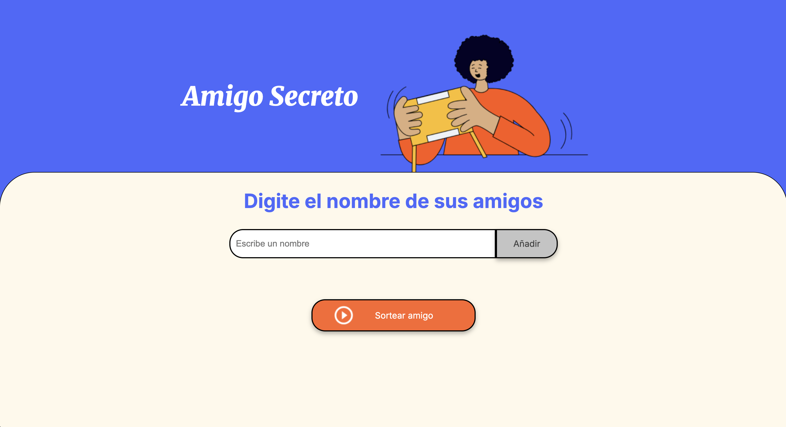
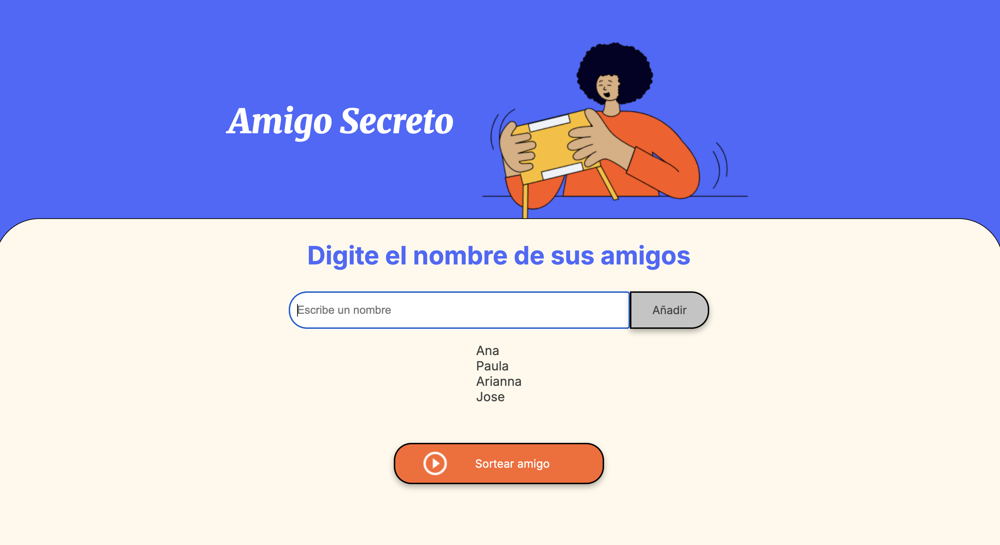
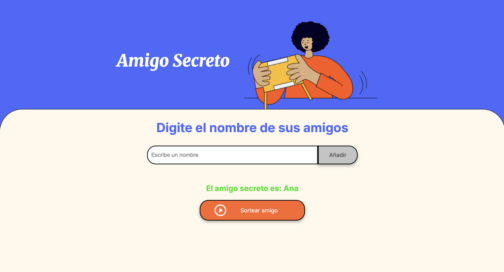

# challenge-amigo-secreto
Challengue Amigo Secreto de Alura

Esta es una aplicación web que permite a los usuarios ingresar nombres de amigos en una lista y luego realizar un **sorteo aleatorio** para determinar quién es el "amigo secreto".  

---

## 🚀 Funcionalidades

- **Agregar nombres**: Los usuarios pueden escribir el nombre de un amigo en un campo de texto y agregarlo a la lista presionando el botón **"Adicionar"**.  
- **Validación de entrada**: Si el campo de texto está vacío, el sistema mostrará una alerta pidiendo ingresar un nombre válido.  
- **Visualizar la lista**: Los nombres ingresados aparecen en una lista debajo del campo de entrada.  
- **Sorteo aleatorio**: Al hacer clic en el botón **"Sortear Amigo"**, se selecciona de forma aleatoria un nombre de la lista y se muestra en la pantalla.  

---

## 🖼️ Así es el Juego

### Vista principal


### Lista con nombres


### Resultado del sorteo


---

## 🛠️ Tecnologías utilizadas

- **HTML5** para la estructura  
- **CSS3** para estilos básicos  
- **JavaScript** para la lógica de la aplicación  

---

## 📌 Instrucciones de uso

1. Clona este repositorio en tu ordenador:
   ```bash
   git clone https://github.com/greccy/challenge-amigo-secreto.git
